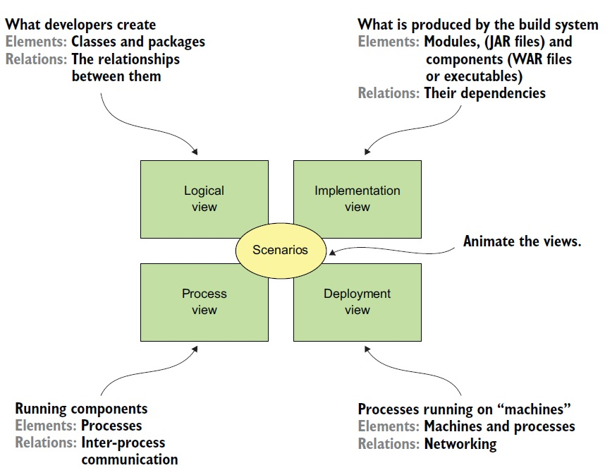

# THE 4+1 VIEW MODEL OF SOFTWARE ARCHITECTURE

## Logical View
- classes, packages , relationships
## Implementations View
- modulles, packaged code , builds, components , executables , deployables
- module dependency , 
- relationship b/w components , modules
## Process View
- Components at Runtime
- relationship b/w processes / IPC
## 
- How processes are mapped to machines
- relationship b/w machines (networks)
- Rleationship b/w processes and machines 

