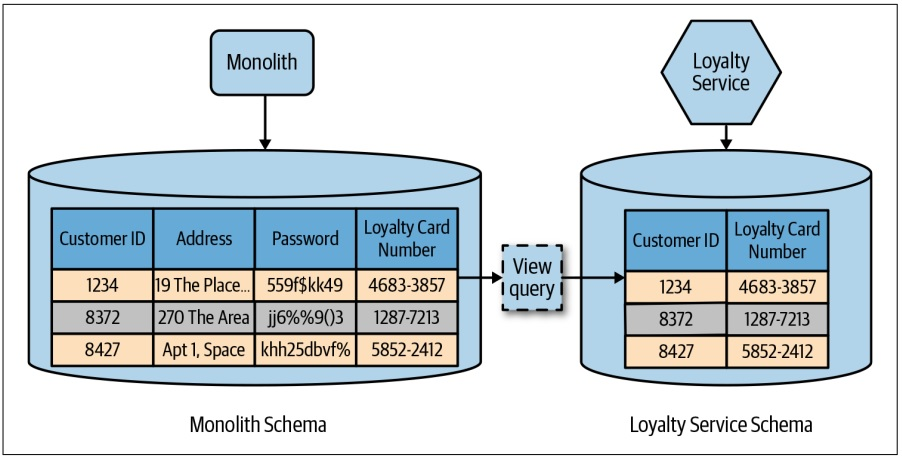

# Decomposing the database
### Index 
- [Shared Database](#Pattern : Shared Database)
- 
## 1. Pattern : Shared Database
- Logical seperation of schema
### Where to use
- Reference data which doesnot change
- Database as a Service (pattern).
#### Cons :
- Single point fo failure.

## 2. Pattern : Database View
### Problem : Your DB is accessed by multiple external systems causing performance issues to your DB
### Solution: Present a view to the service, a projection of the underlying schema. 

- For example 
- you have a customer table with __( id, address password, Loyalty Card number).__
- your external service needs only __ID and Loyalty card Number__ .
- __Create a view__ with only __ID and Loyality card number.__
- The ability of view to project only limited information from underlying source allows us to implement a form of Information hiding.
- This reduces the reads on your main table. 

### Limitations :
- Views are Read-Only.
- DB Engines may need the views and schema to be in the same DB engine.
- This can lead to single point of failure.
- Changes to the underlying schema may require the view to be updates.
### Where to Use :
- Where it is impractical to decompose the existing monolith schema.
- Ideally, Avoid the need for views and tyr for a proper schema decomposition.

## 3. Pattern : Database wrapping service
### Problem : Your DB is too hard to deal with , Hiding the mess can make sense.
- Your DB is too loaded and its not feasible to accomidate more DB objects for future scalability
### Solution : 
- place an explicit service wrapper around the schema, and making it clear that the data can be accessed only through that service.
- hide the data‐base behind this service wrapper that acts as a thin wrapper, moving database dependencies to become service dependencies.
- Encourage teams to think as this common schema as someone else's and store their own data locally.
- This solves the puts brakes on the DB growing further.
### Where to use it ?
- where the underlying schema is just too hard to consider pulling apart.
- 
### Pros and Cons
- The wrapping service can also take writes via API calls
- Require upstream consumers to makechanges; they have to shift from direct DB access to API calls.
- Using this pattern would be a stepping stone to more fundamental changes,giving you time to break apart the schema underneath your API layer.

## 4. Pattern : Database as a Service Interface service
### Problem :
- Clients just need a DB query to fetch a larges amount of data. ( Can be due to using some 3rd party tools (like Tableau) that needs a sql endpoint).
- It makes sense to expose the data our service manager.
- But expose this by creating a seperate Read only database.
### Solution :
-  create a dedicated database designed to be exposed as a read-only endpoint.
-  have this database populated when the data in the underlying database changes.
-  Your DB yould have normal endpoints to do Read/Write fro external clients
-  But also have a seperate Db as an endpoint (Read Only)
-  Have a __mapping engine__ update this seperate database (hourly,daily or weekly) to be consistent with the Internal Service DB.

### Implementing Mapping Engine
- Using Change Data Capture System __CDC__
- Use Batch process to copy over
  - Batch processes are not reliable.
  - Can cause longer lag.
  - Determining which data to be copied over will be a issue.
- Listen to events fired from the service in question, and use that to update the external database.
  - __Debezium__ is one such CDC tool. 

### Pro's and Cons 
-  Mapping engine will always have a lag behind writes made to Internal DB.
-  The choice of mapping engine will determine this lag.
-  Clients need to understand that they are seeing potential stale data.
#### Compared to views
- Views need to be on same schema
- With this you can have different tech stack for Internal and external DB's
- this may place restrictions on how this interface can evolve.
- Start with the use of a data‐base view and consider a shift to a dedicated reporting database later on.
### Where to use it ?
- Clients who needs Read Only access.
- Reporting where client need to join across large amounts of data.
- This could be extended into a larger data warehouse, allowing for data from multiple services to be queried.
- Keeping the data consistent b/w both databases might be a complex undertaking.

## Data Synchronization

## 5. Pattern: Synchronize Data in Application
### Steps
- Step 1: Bulk Synchronization
  - Batch migrate data from one DB to another.
  - Keep existing system running
  - Once migration is completed migrate the delta using a __change data capture__ process.   
- Step 2: Synchronize on Write, Read from Old Schema
  - With both apps now in sync , Write data to both databases (Till new app is stabilized).
  - Your old app will do R/W to old db and new app will only Wrete to new DB

- Step 3: Synchronize on Write, Read from New Schema
  - Once the new app is verified , make sure the reada works too on the new DB.
  - Now new DB is the source of truth
  - Note : we will wirte to both DB's so if there is an issue there will be a fall back option.
  - 
### Where to use this pattern ?
- If you want to split the schema before splitting out the application code.
- If implemented correctly, both data sources should always be in sync.
- This offers us significant benefits in situations where we need fast switching between sources for rollback scenarios, etc.

## 6. Pattern: Tracer Write
