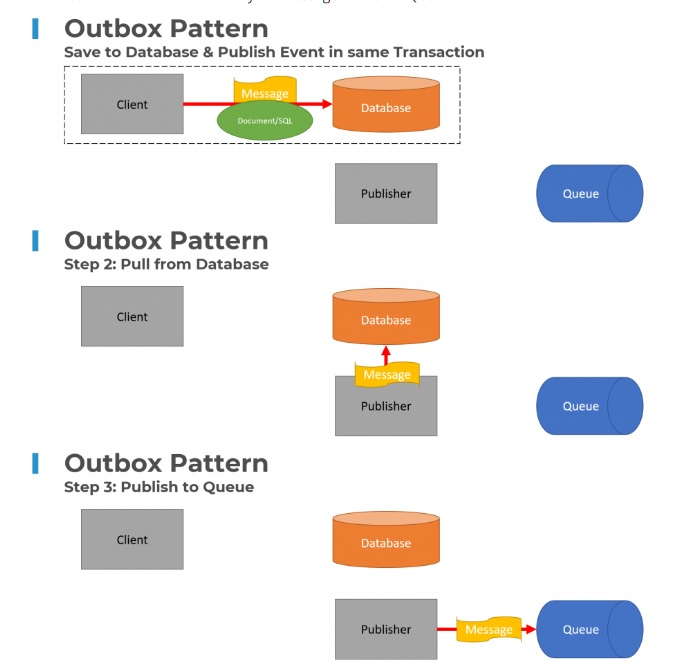

# Event Driven Architecture Patterns

## 1. Outbox Pattern
### Problem
- An Event happened in your Boundary/System and you want to notify an another Boundary/System.
- Steps
  -  Save the event to DB.
  -  Publish the event to Message Broker/Queue.
- What happens if publishing to Message Broker/Queue.

### Solution
- The Outbox Pattern solves this problem by writing the messages to be published to the database(Imagine Outbox) with your state changes within the same transaction. 
- A seperate job/publisher will pull the messages and send them to your Message Broker/Queue.

- Source : https://codeopinion.com/my-top-patterns-for-event-driven-architecture

## 2. Event Choreography & Orchestration (SAGA)
### Problem
- Consistency dor Distributed Transaction

### Solution

Event Choreography is driven entirely by events being consumed and published by various boundaries within a system. There is no centralized coordination or logic. A long-running process workflow is created by one boundary publishing an event, another consuming it and performing some action, then publishing its own event. Depending on the workflow there could be many services involved but they are entirely decoupled and have no knowledge about how the entire workflow works.
